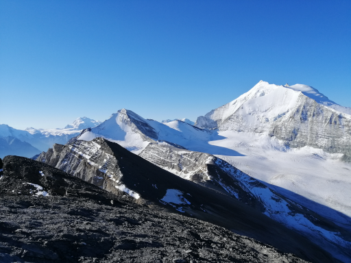
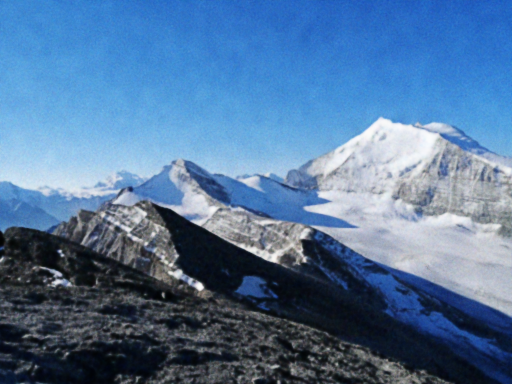

# neural_image

A neural network learning the mapping between pixel coordinates and pixel color
of an image.

The 2D input coordinates $`\left[x, y\right]^T = \mathbf{v}`$ are not used
directly, but converted to a set of Fourier features with the mapping
$`\gamma(\mathbf{v}) = \left[\cos(2\pi\mathbf{F}\mathbf{v})^T, \sin(2\pi\mathbf{F}\mathbf{v})^T\right]^T`$
, where $`\mathbf{F} \in \mathbb{R}^{n\times2}`$.
Each row $`\left[f_x, f_y\right]`$ of $`\mathbf{F}`$ is a random spatial
frequency sampled from a Gaussian distribution with mean 0 and a diagonal
covariance matrix depending on the dimensions of the image.

This mapping dramatically improves the network's ability to learn high-frequency
details.

## Example

The output image was obtained using 256 Gaussian input Fourier features, 3 leaky
ReLU hidden layers of sizes {256, 256, 256}, and a sigmoid 3-channel output
layer.
The network was trained using stochastic gradient descent for 100 epochs with a
learning rate of 0.002.




# TODO

- Mini-batch gradient descent
- Allow to train without Fourier features if the given input size is 2

## Build

All dependencies are handled
by [CPM.cmake](https://github.com/cpm-cmake/CPM.cmake).

```
git clone https://github.com/mschertenleib/neural_image.git
cd neural_image
cmake -S . -B build -DCMAKE_BUILD_TYPE=Release
cmake --build build --target neural_image
```

## Usage

```
SYNOPSIS
        neural_image.exe -h
        neural_image.exe -i <input> -o <output> [-W <width>] [-H <height>] [-a <layer_sizes>...]
                         [-g] [-e <epochs>] [-l <learning_rate>]

OPTIONS
        -h, --help  Show this message and exit
        -i, --input <input>
                    The input image (JPEG, PNG, TGA, BMP, PSD, GIF, HDR, PIC, PNM)

        -o, --output <output>
                    The output image (PNG)

        -W, --width <width>
                    The width of the output image

        -H, --height <height>
                    The height of the output image

        -a, --arch <layer_sizes>
                    Sizes of the network layers (includes the input size but excludes the output
                    size)

        -g, --gray  Force grayscale for the output image (by default, the output will be either RGB
                    or grayscale depending on the input)

        -e, --epochs <epochs>
                    Number of training epochs

        -l, --learning_rate <learning_rate>
                    Learning rate
```

## External libraries

- [Eigen](https://eigen.tuxfamily.org/index.php?title=Main_Page) for
  matrix/vector operations
- [stb_image and stb_image_write](https://github.com/nothings/stb) for image
  reading/writing
- [clipp](https://github.com/muellan/clipp) for command line argument parsing

## Inspiration & References

- https://www.youtube.com/watch?v=TkwXa7Cvfr8
- https://www.youtube.com/watch?v=eqIMsdYPaNs
- K. He, X. Zhang, S. Ren and J. Sun, "Delving Deep into Rectifiers: Surpassing
  Human-Level Performance on ImageNet Classification", 2015,
  doi: https://doi.org/10.48550/arXiv.1502.01852
- M. Tancik, P. P. Srinivasan, B. Mildenhall, S. Fridovich-Keil, N. Raghavan, U.
  Singhal, R. Ramamoorthi, J. T. Barron and R. Ng, "Fourier Features Let
  Networks Learn High Frequency Functions in Low Dimensional Domains", 2020,
  doi: https://doi.org/10.48550/arXiv.2006.10739

## License

This software is released under [MIT License](LICENSE).
