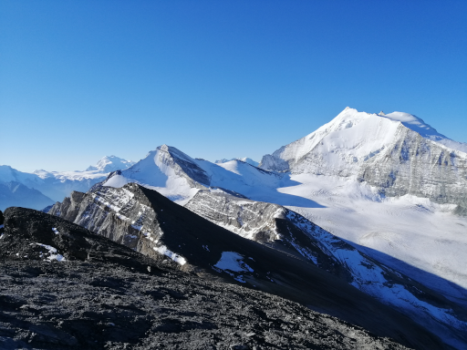
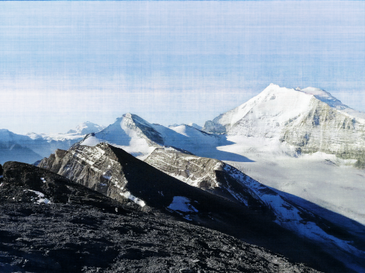

# neural_image

A neural network learning the mapping between pixel coordinates and pixel color
of an image. In practice, the 2D input is not used directly, but converted to a
set of sines and cosines of different frequencies (Fourier features), allowing
the network to learn high-frequency details much more easily.

## Example

The output image was obtained using 128 input Fourier features, 3
leaky ReLU hidden layers of 128 neurons each, and a sigmoid output layer. The
network was trained using stochastic gradient descent for 100 epochs.




## Build

All dependencies are handled
by [CPM.cmake](https://github.com/cpm-cmake/CPM.cmake).

```
git clone https://github.com/mschertenleib/neural_image.git
cd neural_image
cmake -S . -B build -DCMAKE_BUILD_TYPE=Release
cmake --build build --target neural_image
```

## External libraries

- [Eigen](https://github.com/libeigen/eigen)
- [stb_image](https://github.com/nothings/stb)
- [stb_image_write](https://github.com/nothings/stb)
- [CLI11](https://github.com/CLIUtils/CLI11)

## Inspiration & References

- https://www.youtube.com/watch?v=TkwXa7Cvfr8
- https://www.youtube.com/watch?v=eqIMsdYPaNs
- K. He, X. Zhang, S. Ren and J. Sun, "Delving Deep into Rectifiers: Surpassing
  Human-Level Performance on ImageNet Classification", 2015,
  doi: https://doi.org/10.48550/arXiv.1502.01852
- M. Tancik, P. P. Srinivasan, B. Mildenhall, S. Fridovich-Keil, N. Raghavan, U.
  Singhal, R. Ramamoorthi, J. T. Barron and R. Ng, "Fourier Features Let
  Networks Learn High Frequency Functions in Low Dimensional Domains", 2020,
  doi: https://doi.org/10.48550/arXiv.2006.10739

## License

This software is released under [MIT License](LICENSE).
